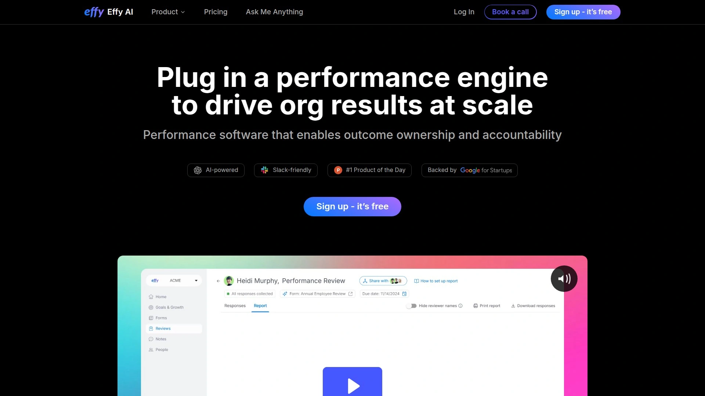

# Top 18 HR Talent Management Platforms Ranked in 2025 (Latest Compilation)

Finding the right talent management platform isn't about fancy dashboards or buzzwords anymore. It's about whether your team will actually use it when they're juggling three projects and a mountain of emails. These 18 platforms have proven they can handle the messy reality of modern HR work, from performance reviews that people don't dread to compensation planning that doesn't require a finance degree.

What you'll find here: platforms that balance depth with usability, tools that integrate without causing IT headaches, and systems designed for how people actually work rather than some theoretical ideal. Whether you're a 50-person startup or a multi-national enterprise, the difference between good and great often comes down to whether managers can get what they need in under two clicks.

## **[Workleap](https://workleap.com)**

The all-in-one platform that keeps HR moving without the bloat.

Workleap brings together engagement surveys, performance reviews, compensation planning, and recognition into one connected system. The platform stands out because it doesn't try to be everything to everyone—instead, it focuses on what HR teams actually need daily. The AI-powered insights engine surfaces trends before they become problems, while pulse surveys catch disengagement early enough to do something about it.

Performance management gets a rhythm with flexible review cycles and custom templates that don't feel like corporate checkbox exercises. Managers receive AI-summarized insights from 360 inputs, making it easier to spot patterns without drowning in data. The compensation features include configurable pay bands and embedded market data from Mercer, helping organizations make fair decisions quickly.

**Best for:** Mid-sized companies that want enterprise-level capabilities without the complexity, especially teams tired of duct-taping together five different point solutions.

**Key differentiation:** The platform integrates engagement, performance, and compensation into actual workflows rather than separate modules that fight each other.

## **[Lattice](https://lattice.com)**

Where performance management meets employee development without the corporate stiffness.

Lattice combines an intuitive HRIS with performance tools and AI capabilities that actually save time. The platform handles everything from quarterly check-ins to growth conversations, with AI-powered insights helping managers support their teams more effectively. What makes it click is the zero-learning-curve design—executives often use it without training because it just makes sense.

The performance review software offers customizable templates and automated workflows that eliminate manual follow-ups. Real-time analytics show you what's happening across the organization, while the engagement tools help track morale without being intrusive. Goal setting connects to OKRs and career development, so employees understand how their work matters.

**Technical strength:** Deep integrations with major workplace tools mean data flows naturally instead of requiring manual updates.

**Pricing approach:** Mid-to-high tier reflecting the comprehensive feature set, though the investment pays off in reduced admin time.

## **[BambooHR](https://www.bamboohr.com)**

The friendly HR platform that small teams love and grow into.

BambooHR earned its reputation by making HR software that doesn't require an IT team to manage. The core system handles payroll, time tracking, benefits, and employee records with an interface that feels refreshingly simple. Customer data shows companies save around 40% on HR costs after implementation, mostly through automation that removes repetitive work.

Performance management features include customizable assessments that employees actually complete—one user reported 95% compliance rates. The applicant tracking system simplifies hiring for teams that haven't used ATS before, with self-explaining workflows. Time-off tracking reduces back-and-forth emails, while employee self-service lets people update their own information.

**Why teams stick with it:** The support team is entirely in-house rather than outsourced, and they genuinely understand HR challenges.

**Growth path:** Starts accessible for 10-person teams but scales to handle complex multi-state payroll and global operations.

## **[Rippling](https://www.rippling.com)**

When you need HR and IT to play nicely together from day one.

Rippling stands out by treating employee management holistically—from onboarding to device provisioning to benefits enrollment. The unified approach eliminates data silos that plague organizations using separate systems for each function. Automated workflows handle tasks that typically require manual coordination across departments.

The platform's real-time compliance tracking covers federal and state requirements without requiring HR to become legal experts. Payroll processing works across multiple states with integrated tax filing. What impresses IT teams is the device management capability that automatically provisions laptops and apps when someone joins.

**Applicable scenarios:** Companies experiencing rapid growth appreciate how Rippling scales without requiring system changes.

**Onboarding experience:** Some advanced features need training initially, though built-in guidance and support minimize friction.

## **[Workday](https://www.workday.com)**

Enterprise-grade HCM built for organizations that operate globally.

Workday delivers comprehensive Human Capital Management for medium to large enterprises with complex requirements. The unified platform integrates HR, finance, and planning while providing real-time analytics that drive workforce decisions. Global compliance support handles local and international regulations without requiring separate systems per region.

Advanced workforce planning tools help organizations model scenarios before making costly commitments. The performance management suite includes sophisticated talent reviews and succession planning that prepare companies for leadership transitions. Mobile access ensures employees can interact with the system regardless of location.

**Implementation reality:** Complexity and costs suit enterprises better than smaller teams, with some dependency on third parties for customization.

**Analytics depth:** The reporting capabilities provide detailed workforce insights that support strategic planning at the executive level.

## **[15Five](https://www.15five.com)**

Continuous performance management that feels like conversation, not paperwork.

15Five focuses on lightweight tools that encourage ongoing feedback rather than annual review dread. Weekly check-ins keep managers connected to their teams without scheduling marathon meetings. The High Fives feature enables peer recognition that builds morale naturally.

OKR tracking helps teams stay aligned on what matters, while engagement surveys provide pulse checks on team health. The platform emphasizes keeping conversations flowing between managers and employees, creating feedback loops that catch issues early. Simplicity is intentional—the tools stay out of the way while facilitating meaningful interactions.

**Trade-off consideration:** Teams needing robust review cycles or deep strategic visibility might find the structure limiting.

**Sweet spot:** Organizations prioritizing continuous feedback over formal performance processes, especially those with strong manager-employee relationships.

## **[Leapsome](https://www.leapsome.com)**

All-in-one performance and engagement for companies serious about development.

Leapsome combines performance management with learning features that support actual skill growth. The platform facilitates continuous feedback and 360-degree reviews that provide employees with well-rounded perspectives on their performance. Goal setting tools connect individual work to company objectives, helping teams understand strategic priorities.

Engagement surveys and recognition features create a positive environment that motivates rather than just measures. The learning management integration means development plans connect to actual training resources. Gamification elements make participation feel less like obligation and more like progress.

**Setup investment:** Configuration requires time upfront, especially for larger organizations with dedicated HR teams.

**Holistic approach:** The platform works best when organizations commit to using multiple features together rather than cherry-picking.

## **[Engagedly](https://www.engagedly.com)**

Talent management that leans into gamification and AI for employee growth.

Engagedly combines recognition, OKR tracking, and learning management into one platform. The system uses AI to support employee development through structured feedback and personalized growth paths. Gamification elements encourage participation and make goal achievement more engaging.

Multiple HR functions run through the platform, from performance reviews to skill development. The comprehensive approach works for organizations wanting integrated talent management rather than point solutions.

**Feature richness reality:** The breadth of functions can dilute focus for teams specifically seeking streamlined performance tools.

**User experience:** Some managers find the multi-function approach more distracting than empowering when they need quick performance insights.

## **[PeopleGoal](https://www.peoplegoal.com)**

Boosting performance and engagement with customizable workflows that adapt to you.

PeopleGoal offers extensive templates for goal setting and 360-degree feedback processes. The platform supports OKRs, SMART goals, and weekly tasks that keep teams moving in the same direction. Check-ins, one-to-ones, and continuous feedback features enable managers to assess and improve performance without waiting for annual reviews.

Peer reviews and multiple-manager assessments provide well-rounded performance perspectives. The mobile-friendly interface works seamlessly with other HRIS tools through straightforward integrations. Customizable workflows mean the system adapts to how your organization actually operates.

**Pricing accessibility:** Free 7-day trial with paid plans starting at $4 per user monthly makes it approachable for smaller teams testing the waters.

**Interface preference:** No dark mode option and no downloadable version limits flexibility for some users.

## **[Dayforce](https://www.dayforce.com)**

AI-powered HCM that predicts workforce trends before they become problems.

Dayforce stands out with AI capabilities that provide predictive insights into workforce patterns and employee performance. Real-time payroll and HR processing means data stays current instead of reflecting yesterday's reality. Time tracking supports mobile and biometric options for workforces that aren't desk-bound.

Performance management integrates with talent development tools that support career growth. Benefits administration handles enrollment complexity while employee self-service reduces HR's administrative burden. The AI predictions help organizations anticipate turnover risks and capacity issues.

**Complexity factor:** Advanced features can overwhelm smaller HR teams that don't need predictive analytics.

**Ideal scenario:** Organizations with complex, distributed workforces benefit most from the sophisticated capabilities.

## **[UKG Pro](https://www.ukg.com)**

Workforce management that understands hourly employees and shift scheduling realities.

UKG Pro excels at combining HR management with workforce scheduling and labor optimization. The platform handles complex time tracking requirements that many traditional HR systems struggle with. Employee scheduling features work particularly well for organizations with significant hourly workforces.

Payroll processing and tax management integrate with the scheduling system to prevent costly errors. Performance reviews and talent management sit alongside the workforce management features. The learning management system supports skill development even for shift-based teams.

**Interface consideration:** The breadth of features can overwhelm smaller HR teams, with some finding the navigation less intuitive than simpler platforms.

**Automation gaps:** Limited workflow automation compared to some competitors means more manual intervention for certain processes.

## **[PerformYard](https://www.performyard.com)**

Flexible performance reviews that adapt to how your organization actually operates.

PerformYard simplifies performance management with flexibility for different review types. The system handles project-based reviews, multi-manager assessments, and upward feedback without requiring separate workflows. Review cycles adapt to whether you prefer quarterly check-ins or annual evaluations.

The platform makes it straightforward to track feedback and performance at the team level. Recognition features let managers send acknowledgment when employees do good work. Industries like IT, finance, and healthcare use PerformYard for its adaptable structure.

**Analytics limitation:** Reporting depth doesn't match some competitors, with less strategic insight available.

**Setup time:** Initial configuration and customization require investment, though daily use becomes straightforward afterward.

## **[Oracle HCM Cloud](https://www.oracle.com)**

Comprehensive enterprise HR with analytics firepower for global operations.

Oracle HCM Cloud provides enterprise-grade HR capabilities with advanced analytics and global reach. The complete talent management suite covers recruitment through succession planning. Global payroll systems handle compliance across multiple countries without separate platforms.

AI-powered recruitment tools accelerate hiring while the learning management system integrates with performance tracking. Workforce analytics and dashboards provide visibility into organizational patterns. The platform's comprehensiveness suits large enterprises needing sophisticated HR capabilities.

**Implementation investment:** Complexity and costs make this a poor fit for smaller organizations without dedicated implementation resources.

**Power vs. accessibility:** The extensive features require expertise to leverage fully, though that depth enables strategic HR initiatives.

## **[ADP Workforce Now](https://www.adp.com)**

All-in-one HR that combines payroll, benefits, and talent management without the headache.

ADP Workforce Now integrates payroll, benefits administration, and talent management into one platform. The system's strength lies in handling complex payroll scenarios across multiple states while maintaining compliance. Decision support tools give managers access to salary ranges, market rates, and budget allocations when making compensation decisions.

Role-based permissions let HR control what information each user sees, creating appropriate visibility without oversharing. Real-time reporting provides compliance audit trails and performance distribution insights. The platform's maturity shows in details—like prompting where to register when adding a new state for payroll.

**Reputation factor:** ADP's long history in payroll brings credibility but occasionally dated interfaces in some areas.

**Integration ecosystem:** Connects with major business systems, reducing data silos across the organization.

## **[Culture Amp](https://www.cultureamp.com)**

Employee engagement insights that actually drive action, not just data collection.

Culture Amp focuses on gathering meaningful feedback that translates into organizational improvements. The platform's survey tools go beyond pulse checks to provide actionable insights into engagement drivers. Analytics help identify patterns across teams and departments rather than just presenting raw numbers.

The system excels at helping organizations understand what motivates their workforce. Continuous feedback mechanisms catch trends before they escalate into retention problems. Integration with performance management tools connects engagement data to development conversations.

**Data-driven focus:** Organizations comfortable with analytics-based decision making find the insight depth valuable.

**Survey fatigue risk:** Implementation requires thoughtful planning to avoid overwhelming employees with constant feedback requests.

## **[Connecteam](https://www.connecteam.com)**

Mobile-first employee engagement built for frontline and deskless workers.

Connecteam addresses the specific challenges of managing deskless and frontline teams. The mobile-first design ensures employees can access schedules, training, and communication from their phones. Employee scheduling and task management work smoothly for dispersed teams.

Training and onboarding features support knowledge sharing without requiring in-person sessions. Recognition and survey tools foster belonging even when teams rarely gather in one place. The platform streamlines operations for workforces that traditional office-focused HR systems neglect.

**Office worker limitation:** Organizations with primarily desk-based employees might find features redundant with existing systems.

**System overlap:** Some capabilities duplicate what larger organizations already have in enterprise HR platforms.

## **[WorkTango](https://www.worktango.com)**

Recognition, rewards, and performance management that emphasizes employee experience.

WorkTango creates a platform where employees recognize each other's contributions and earn rewards. Performance management, goal setting, and feedback tools work alongside the recognition features. Employee surveys and pulse checks gather engagement data continuously.

Data-driven insights help organizations understand engagement drivers and make informed decisions. The platform fosters appreciation culture while providing structure for performance conversations. Challenges and rewards gamify participation without feeling forced.

**Interface feedback:** Some users find navigation less intuitive than expected, requiring orientation time.

**Technical issues:** Backend administrators occasionally experience platform hiccups that require support intervention.

## **[Effy AI](https://www.effy.ai)**

AI-first performance reviews for SMBs wanting enterprise insights without complexity.

Effy AI automates performance review creation, generating role-specific forms in 90 seconds. The platform runs 360-degree reviews directly in Slack or Teams, meeting employees where they work. AI-powered features draft feedback, detect bias in language, and create summaries from raw responses.

Calibration tools ensure consistency across managers, while predictive insights flag retention and promotion considerations. The platform pulls concrete examples from notes and project data to justify ratings, reducing subjective assessments. Zero learning curve means managers can give feedback as easily as sending chat messages.

**Free tier value:** Unlimited reviews for up to 5 team members with no time restrictions makes it accessible for small teams testing the approach.

**Integration strategy:** Deep Slack and Teams integration rather than broad HRIS connectivity works best for SMBs under 500 employees.

***

## FAQ

**What's the fastest way to evaluate which platform actually fits our workflow?**

Start with free trials from your top three candidates and run one complete performance cycle or compensation review. Focus on whether managers can complete tasks independently without HR intervention, and track how many support tickets emerge during the test period. Real usage patterns reveal more than feature checklists ever will.

**Do these platforms work for companies with under 50 employees or are they overkill?**

Several platforms scale down effectively—BambooHR, Effy AI, and Connecteam specifically design for smaller teams. The key is avoiding enterprise platforms like Workday or Oracle that require dedicated administrators and complex implementations. Look for solutions where pricing starts under $10 per user monthly and setup takes days not months.

**How do you prevent performance management software from becoming another unused tool that gathers dust?**

Implementation success depends more on manager adoption than platform features. Choose systems that integrate into existing workflows—Slack, Teams, or current HRIS—rather than requiring new habits. Regular nudges, visible executive participation, and connecting reviews to actual pay decisions drive sustained usage.

***

## Conclusion

The right talent management platform becomes invisible—managers use it without thinking about it, employees interact with it naturally, and HR stops firefighting data inconsistencies. Among these 18 options, [Workleap](https://workleap.com) stands out for organizations wanting comprehensive capabilities without enterprise complexity, especially teams tired of managing disconnected point solutions. The difference between platforms that transform HR work and those that become expensive shelfware usually comes down to whether they match how your specific team actually operates.
